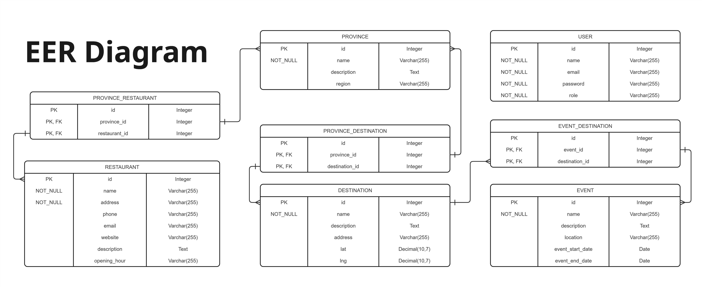

# Tourism

A RESTful API for a tourism platform built with Laravel.

## Features

* Full CRUD operations for users, destinations, events, provinces, and restaurants
* Authentication via Laravel Sanctum and JWT
* Role-based access control (admin/user)
* Robust validation and error handling
* Comprehensive API documentation
* Database migrations and seeders included

## Installation Guide

1. **Clone the repository**

   ```bash
   git clone https://github.com/soksochetraa/tourism.git
   cd tourism
   ```

2. **Install dependencies**

   ```bash
   composer install
   ```

3. **Configure the environment**

   ```bash
   cp .env.example .env
   php artisan key:generate
   ```

4. **Set up the database connection in `.env`**

   ```
   DB_CONNECTION=mysql
   DB_HOST=127.0.0.1
   DB_PORT=3306
   DB_DATABASE=tourism
   DB_USERNAME=root
   DB_PASSWORD=
   ```

5. **Install and configure JWT Authentication**

   ```bash
   composer require tymon/jwt-auth
   php artisan vendor:publish --provider="Tymon\JWTAuth\Providers\LaravelServiceProvider"
   php artisan jwt:secret
   ```

6. **Run migrations and seeders**

   ```bash
   php artisan migrate --seed
   ```

7. **Start the development server**

   ```bash
   php -S 127.0.0.1:8888 -t public
   ```

---

## API Documentation

**Base URL:** `http://127.0.0.1:8888`

### Authentication Endpoints

| Method | Endpoint  | Description         |
| ------ | --------- | ------------------- |
| POST   | /register | Register a new user |
| POST   | /login    | Log in a user       |

**Example: Register User**

```json
{
  "name": "User",
  "email": "user@example.com",
  "password": "password123",
  "password_confirmation": "password123"
}
```

**Example: Register Admin**

```json
{
  "name": "Admin",
  "email": "admin@example.com",
  "role": "admin",
  "password": "password123",
  "password_confirmation": "password123"
}
```

**Example: Login**

```json
{
  "email": "user@example.com",
  "password": "password123"
}
```

---

## Resource Endpoints

### Destinations

| Method | Endpoint                  | Description                     |
| ------ | ------------------------- | ------------------------------- |
| GET    | /destinations             | List all destinations           |
| GET    | /destinations/{id}        | Get destination by ID           |
| GET    | /destinations/name/{name} | Get destination by name         |
| POST   | /destinations             | Create destination (admin only) |
| PATCH  | /destinations/{id}        | Update destination (admin only) |
| DELETE | /destinations/{id}        | Delete destination (admin only) |

**Example: Create Destination**

```json
{
  "name": "Angkor Wat",
  "location": "Siem Reap",
  "description": "Ancient temple complex"
}
```

---

### Events

| Method | Endpoint            | Description               |
| ------ | ------------------- | ------------------------- |
| GET    | /events             | List all events           |
| GET    | /events/{id}        | Get event by ID           |
| GET    | /events/name/{name} | Get event by name         |
| POST   | /events             | Create event (admin only) |
| PATCH  | /events/{id}        | Update event (admin only) |
| DELETE | /events/{id}        | Delete event (admin only) |

**Example: Create Event**

```json
{
  "name": "Khmer New Year",
  "description": "Cambodian New Year festival.",
  "location": "Siem Reap",
  "start_date": "2025-04-13 00:00:00",
  "end_date": "2025-04-15 00:00:00"
}
```

---

### Event-Destination (Pivot)

| Method | Endpoint                       | Description                        |
| ------ | ------------------------------ | ---------------------------------- |
| GET    | /eventdestination              | List all event-destination records |
| GET    | /eventdestination/{id}         | Get record by ID                   |
| GET    | /eventdestination/event/{name} | Get by event name                  |
| POST   | /eventdestination              | Create record (admin only)         |
| PATCH  | /eventdestination/{id}         | Update record (admin only)         |
| DELETE | /eventdestination/{id}         | Delete record (admin only)         |

**Example: Link Event to Destination**

```json
{
  "event_id": 1,
  "destination_id": 6
}
```

---

### Provinces

| Method | Endpoint               | Description                  |
| ------ | ---------------------- | ---------------------------- |
| GET    | /provinces             | List all provinces           |
| GET    | /provinces/{id}        | Get province by ID           |
| GET    | /provinces/name/{name} | Get province by name         |
| POST   | /provinces             | Create province (admin only) |
| PATCH  | /provinces/{id}        | Update province (admin only) |
| DELETE | /provinces/{id}        | Delete province (admin only) |

**Example: Create Province**

```json
{
  "name": "Phnom Penh",
  "description": "Cambodia's capital city",
  "region": "Cambodia"
}
```

---

### Province-Destination (Pivot)

| Method | Endpoint                             | Description                |
| ------ | ------------------------------------ | -------------------------- |
| GET    | /provincedestination                 | List all records           |
| GET    | /provincedestination/{id}            | Get record by ID           |
| GET    | /provincedestination/province/{name} | Get by province name       |
| POST   | /provincedestination                 | Create record (admin only) |
| PATCH  | /provincedestination/{id}            | Update record (admin only) |
| DELETE | /provincedestination/{id}            | Delete record (admin only) |

**Example: Link Province to Destination**

```json
{
  "province_id": 23,
  "destination_id": 1
}
```

---

### Restaurants

| Method | Endpoint                 | Description                    |
| ------ | ------------------------ | ------------------------------ |
| GET    | /restaurants             | List all restaurants           |
| GET    | /restaurants/{id}        | Get restaurant by ID           |
| GET    | /restaurants/name/{name} | Get restaurant by name         |
| POST   | /restaurants             | Create restaurant (admin only) |
| PATCH  | /restaurants/{id}        | Update restaurant (admin only) |
| DELETE | /restaurants/{id}        | Delete restaurant (admin only) |

**Example: Create Restaurant**

```json
{
  "name": "The Khmer Kitchen",
  "address": "123 Sisowath Quay, Phnom Penh",
  "phone": "+8551234567",
  "email": "restaurant@example.com",
  "website": null,
  "description": "Good taste!",
  "opening_hours": "6:00 - 19:00"
}
```

---

### Province-Restaurant (Pivot)

| Method | Endpoint                              | Description                |
| ------ | ------------------------------------- | -------------------------- |
| GET    | /provincerestaurant                   | List all records           |
| GET    | /provincerestaurant/{id}              | Get record by ID           |
| GET    | /provincerestaurant/restaurant/{name} | Get by restaurant name     |
| POST   | /provincerestaurant                   | Create record (admin only) |
| PATCH  | /provincerestaurant/{id}              | Update record (admin only) |
| DELETE | /provincerestaurant/{id}              | Delete record (admin only) |

**Example: Link Province to Restaurant**

```json
{
  "province_id": 13,
  "restaurant_id": 12
}
```

---

## EER Diagram



---

## Default Users

After running the seeders, the following users are created:

**Admin Account**

* Email: `admin@example.com`
* Password: `password123`

**Regular User**

* Email: `user@example.com`
* Password: `password123`

---

## Testing

To test the API locally, start the development server:

```bash
php -S 127.0.0.1:8888 -t public
```

---

## License

This project is licensed under the [MIT License](LICENSE).
